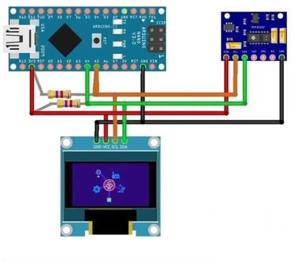
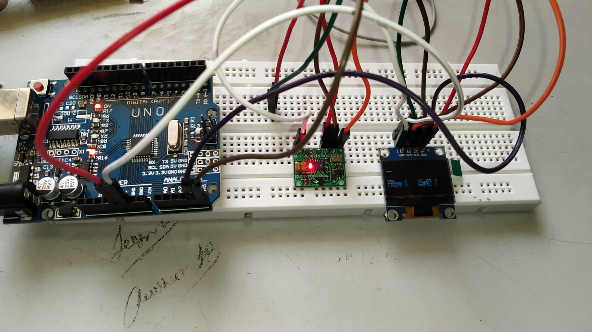

# Pulse Oximeter Project

This project demonstrates a portable, low-cost **Pulse Oximeter** using Arduino Uno, MAX30100 sensor, and an OLED display.

---

## 🧰 Components Used
- Arduino Uno
- MAX30100 Pulse Oximeter Sensor
- 0.96" SSD1306 OLED Display (128x64)
- Jumper Wires
- Breadboard
- 4.7kΩ Resistors (for I2C pull-up)

---

## 🖼️ Circuit Diagram

---

## 📸 Working Device Image

---

## 🔌 Pin Connections

| Module        | Pin     | Arduino Nano |
|---------------|---------|---------------|
| MAX30100      | SDA     | A4            |
| MAX30100      | SCL     | A5            |
| OLED Display  | SDA     | A4            |
| OLED Display  | SCL     | A5            |
| Both          | VCC     | 3.3V          |
| Both          | GND     | GND           |

---

## 📋 Working Principle

The **MAX30100** sensor uses red and IR LEDs to measure the variation in light absorption through a fingertip.

- **Heart Rate:** Detected from blood volume changes.
- **SpO2 Level:** Calculated from light absorption ratio of red and IR LEDs.

The Arduino reads these values and displays them on the OLED display.

---

## 🚀 Getting Started

1. Clone the repository
2. Open `pulse_oximeter.ino` in Arduino IDE
3. Upload to Arduino Nano
4. View results on OLED and Serial Monitor

---

## 📎 License
MIT License

---

## 👥 Authors
- Tushar Prajapati
- Gopal Shankhat

> Guided by Prof. Bhavin Mehta, LD College of Engineering
